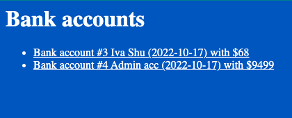
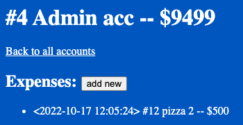
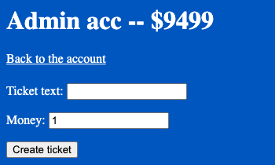

# Bank accounts and expenses
It is a simple django project that helps to keep expenses on bank accounts.

## How to run:
- In the directory of project ```python manage.py runserver```
- Go to ```http://localhost:8000/expenses/``` in your browser

## What I learned:
- object-relational mapper
- views, generic views
- django testing
- forms
- validators
- avoiding race condition via F()






